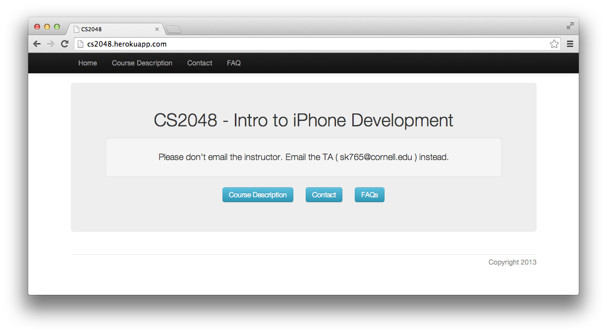
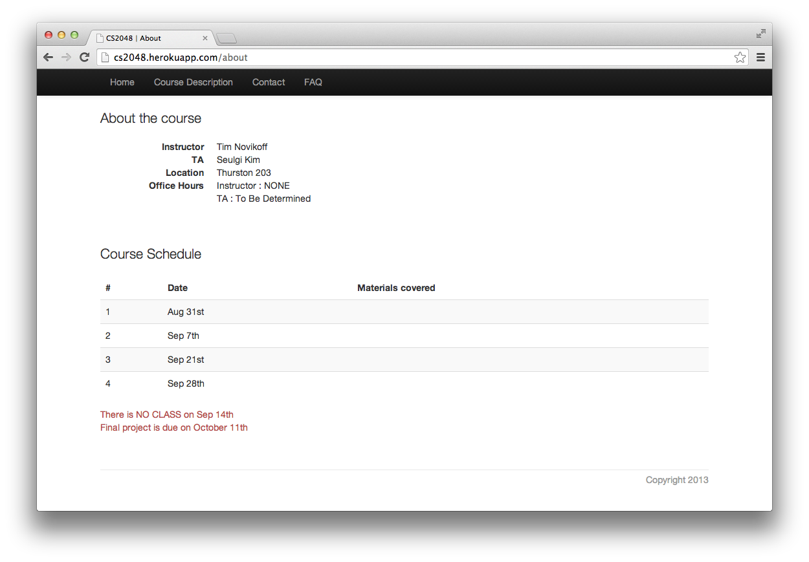
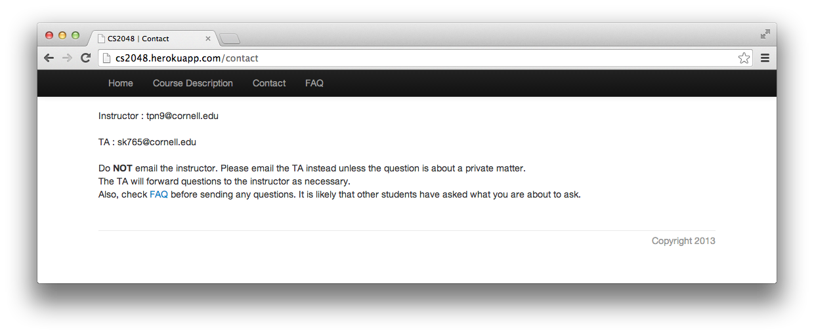
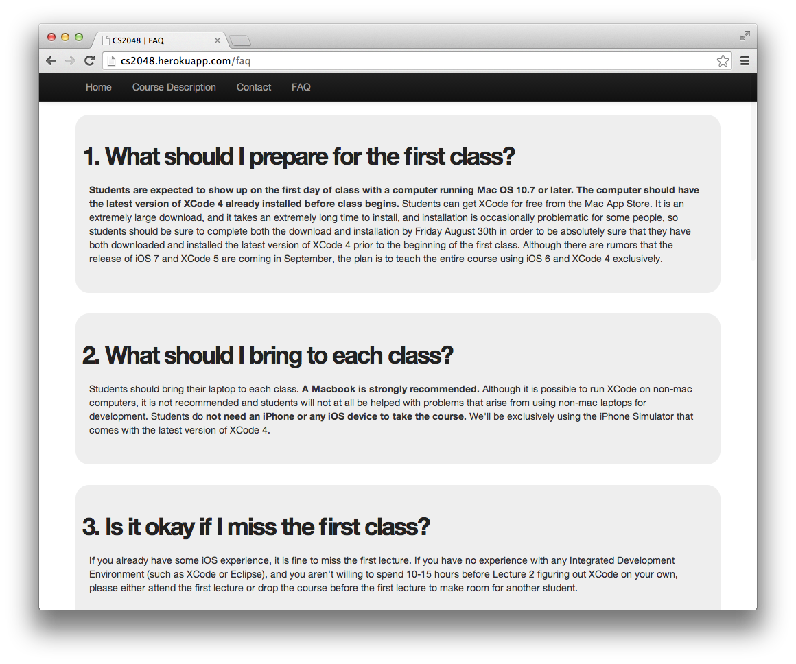

#Computer Science 2048 Homepage
This is a homepage I built for Computer Science course called "CS 2048 - Intro to iPhone Development". The course was taught in Fall 2013. You can visit the homepage by following [this link](http://cs2048.herokuapp.com/ "Go to CS2048 homepage").

##What does it do?
It is an informative website, meaning that it just displays information. This serves as an example for me to look at when I want to write a basic homepage in a short period of time. I guess if you have some experience in Ruby on Rails already, there is not much worth looking at here, maybe aside from using [scss](app/assets/stylesheets/static_pages.css.scss).

##How it looks

